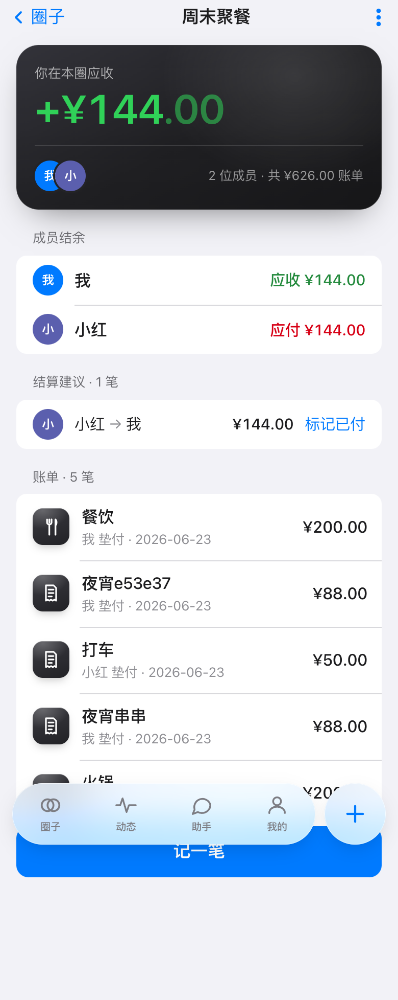
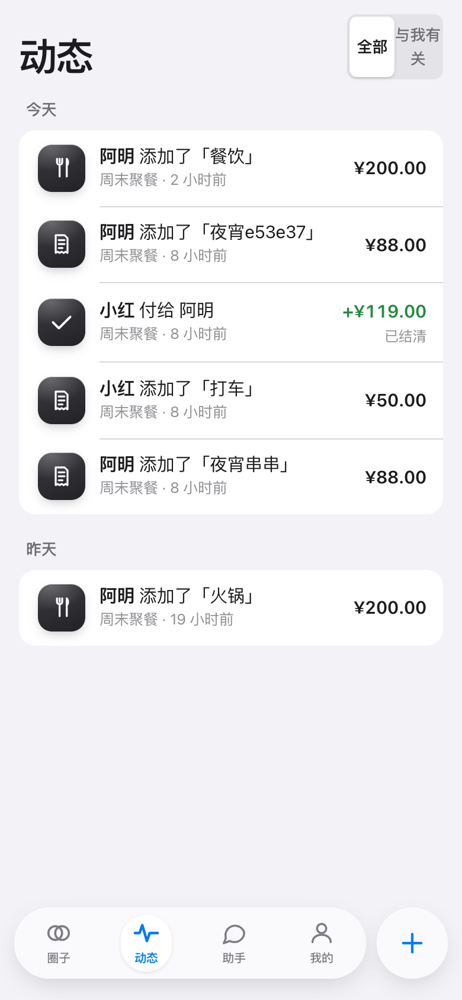
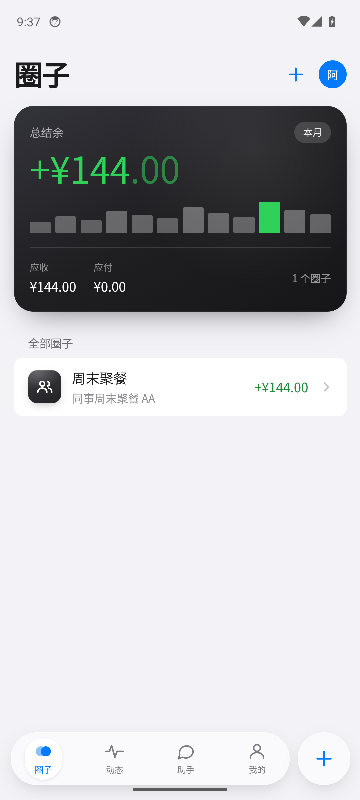

# AA · 记账分账

> 和朋友轻松 AA、记一笔、看谁欠谁 —— 一套代码,五端原生。

**AA 记账** 是一个 AA 制（going-Dutch / bill-splitting）记账 app:记录花销、把朋友拉进「圈子」共享账本、选择和谁分摊（默认平均,也可精确金额 / 份额）、看「谁欠谁多少」并按最少转账一键结算;再叠加「说一句话记一笔」的 AI / 语音能力。

一套 **React + TypeScript + Vite** 前端,用 **Tauri v2** 打包成 **Windows / macOS / Linux 桌面 + Android / iOS 移动** 原生 app(同一份代码也可部署为 Web)。

---

## 截图

| 登录 | 圈子 | 圈子详情 |
|:---:|:---:|:---:|
|  |  |  |
| **记一笔（含 AI 一句话）** | **动态** | **AI 助手** |
|  |  |  |

| Android（真机 E2E:登录→真实数据） | iOS 模拟器（E2E） |
|:---:|:---:|
|  |  |

---

## 功能

- **圈子共享账本** —— 建圈、邀请链接 / 二维码加入,成员实时同步。
- **三种分账** —— 平均 / 精确金额 / 份额(百分比),总和恒等于账单,零头按确定性规则分摊。
- **余额与结算** —— `谁欠谁多少` 一目了然,贪心算法给出 ≤ n−1 笔的最少转账建议,可标记已付。
- **实时同步** —— 基于 Supabase Realtime,A 记一笔,B 1–2 秒内自动刷新。
- **AI 一句话记账** —— 输入 / 语音「昨天和小红吃饭 200 我付的」→ 自动解析金额 / 付款人 / 分摊 → 预填表单确认入账。
- **多平台原生** —— Win / macOS / Linux / Android / iOS,均已构建并在模拟器 / 真机验证。

---

## 架构

```
┌───────────────────────────── apps/app ─────────────────────────────┐
│  React 19 + TS + Vite + Tailwind   (iOS Human Interface 设计)        │
│  HashRouter · TanStack Query · 乐观更新                              │
│            │                                  ▲                      │
│            ▼ Tauri v2 (系统 WebView)          │ Realtime 订阅        │
│   Win / macOS / Linux / Android / iOS 原生壳  │                      │
└────────────┬──────────────────────────────────┼─────────────────────┘
             │ @supabase/supabase-js             │
             ▼                                    │
┌──────────────────────────── Supabase ──────────┴─────────────────────┐
│ Postgres + RLS · Auth(邮箱/手机号 OTP+密码) · Realtime · Storage      │
│ RPC: create_circle / create_expense / create_invitation / accept…     │
│ View: circle_balances(净余额单一权威)                                 │
│ Edge Functions(Deno): parse-expense · agent-query · asr-transcribe    │
└───────────────────────────────────────────────────────────────────────┘
             ▲
             │ import(同源)
┌────────────┴──────────── packages/shared ────────────────────────────┐
│ 纯函数 + 整数分(绝不用 float):money · split · balances · settle      │
│ zod schema(前后端共享)· Vitest + fast-check 属性测试                 │
└───────────────────────────────────────────────────────────────────────┘
```

**设计原则**
- 金额一律用 **整数最小币种单位(分)`bigint`**,绝不用浮点。
- `expense_splits.owed_minor` 永远存「已算好的最终整数分」,净余额只需 `SUM`。
- 分账计算在前端纯函数(实时预览)→ 写库前算好;净余额以 `circle_balances` 视图为权威。
- 加入圈子只能走 `accept_invitation`(service role),杜绝任意人塞进任意圈子。
- AI 是「加速器」不是「必经路」:ASR / LLM 任一失败都能回退到纯手动表单,记账永不中断。

---

## 技术栈

| 层 | 选型 |
|---|---|
| 前端 | React 19 · TypeScript(strict)· Vite 6 · Tailwind · React Router v7 · TanStack Query v5 |
| 跨平台外壳 | Tauri v2(Rust ≥ 1.85;deep-link / updater 插件) |
| 后端 | Supabase:Postgres · Auth · RLS · Realtime · Storage · Edge Functions(Deno) |
| 共享逻辑 | `packages/shared`:整数分 money / 最大余数法分账 / 贪心最少转账 · Vitest + fast-check |
| AI | 厂商无关、可插拔;默认 Claude(Opus 4.8,strict tool use),无 key 时规则兜底 |

---

## 仓库结构

```
AA/
├─ packages/shared/        跨端纯逻辑:money / split / balances / settle / zod schema (+ 测试)
├─ supabase/
│  ├─ migrations/          表 → RLS → 视图 → RPC → grants
│  └─ functions/           parse-expense · agent-query · asr-transcribe (Edge Functions)
├─ apps/app/
│  ├─ src/                 features: auth / circles / expenses / activity / assistant / profile
│  └─ src-tauri/           Tauri v2 工程 + gen/(Android/iOS 原生工程,含构建修复)
├─ scripts/                构建 / 冒烟 / E2E 脚本(android-* · ios-* · verify-* · shot-*)
└─ docs/                   截图等
```

---

## 快速开始

### 先决条件
- Node ≥ 20、npm
- [Supabase CLI](https://supabase.com/docs/guides/cli) + Docker(本地后端;macOS 可用 [colima](https://github.com/abiosoft/colima))
- 桌面 Tauri:Rust ≥ 1.85（`rustup`）

### 1) 安装 + 本地后端

```bash
npm install
supabase start              # 起本地 Postgres / Auth / Realtime / Studio
supabase db reset           # 应用 migrations + seed
cp apps/app/.env.example apps/app/.env   # 填入 supabase start 输出的 URL / anon key
```

### 2) Web / 桌面开发

```bash
npm run dev  --workspace=@aa/app     # 浏览器开发
npm run tauri --workspace=@aa/app -- dev   # 桌面原生窗口(需要 Rust)
```

### 3) 移动端

环境与构建脚本已封装在 `scripts/`(见下)。简述:

```bash
# Android(需 JDK17 + Android SDK/NDK,见 scripts/android-env.sh)
source scripts/android-env.sh
bash scripts/android-build-apk.sh         # 产出 debug APK
bash scripts/android-emulator-boot.sh &   # 启动模拟器
bash scripts/android-smoke.sh             # 安装 + 启动 + 截图

# iOS(需 Xcode + CocoaPods)
cd apps/app && npm run tauri -- ios build --target aarch64-sim
bash scripts/ios-smoke.sh "iPhone 17 Pro"
```

> 移动端 cargo 交叉编译需要 stable Rust ≥ 1.85;`apps/app/rust-toolchain.toml` 已钉好,无需改全局默认。

---

## 脚本

| 脚本 | 作用 |
|---|---|
| `scripts/android-env.sh` | 一键导出 Android 工具链环境(JDK / SDK / NDK / Rust toolchain) |
| `scripts/android-build-apk.sh` | 构建 arm64 debug APK(带重试) |
| `scripts/android-emulator-*.sh` / `android-smoke.sh` / `android-e2e-login.sh` | 装模拟器 / 开机 / 冒烟 / 登录 E2E |
| `scripts/ios-smoke.sh` / `ios-e2e.sh` | iOS 模拟器安装 + 启动 + 截图 / 登录 E2E |
| `scripts/verify-backend.mjs` · `seed-demo.mjs` | 后端校验 / 种子数据 |

---

## 测试

```bash
npm test                                   # packages/shared:分账 / 结算 / 余额 单测 + 属性测试
npm run typecheck --workspace=@aa/app      # 前端 tsc --noEmit
npm run build --workspace=@aa/app          # 生产构建
```

核心断言:`splitEqual(10000,3) → [3334,3333,3333]`、`splitShares` 守恒、`minimizeTransfers` 后每人净额归零且 ≤ n−1 笔、`sum(net) === 0`。

---

## 平台状态

| 平台 | 构建 | 运行验证 | 登录 → 真实数据 |
|---|:---:|:---:|:---:|
| macOS / Windows / Linux 桌面 | ✅ | ✅ | ✅ |
| Android | ✅ | ✅ 模拟器 | ✅ 完整 E2E |
| iOS | ✅ | ✅ 模拟器 | ✅ 完整 E2E |
| Web | ✅ | ✅ | ✅ |

---

## 说明

- 本地 Supabase 的 anon key 是标准本地开发密钥(公开、非生产),`.env` 已被 `.gitignore` 排除,仓库只含 `.env.example` 占位符。
- AI 解析默认走 Edge Function `parse-expense`:设置 `ANTHROPIC_API_KEY` 即启用真实 Claude,未设置时自动回退到规则解析。
- 移动端构建踩过的坑(本机 JVM 的 AES-GCM intrinsic 导致 TLS 下载损坏、`npm run` 切 cwd 致 cargo 用错 toolchain 等)已固化进 `gradle.properties` / `rust-toolchain.toml` / `scripts/`。
