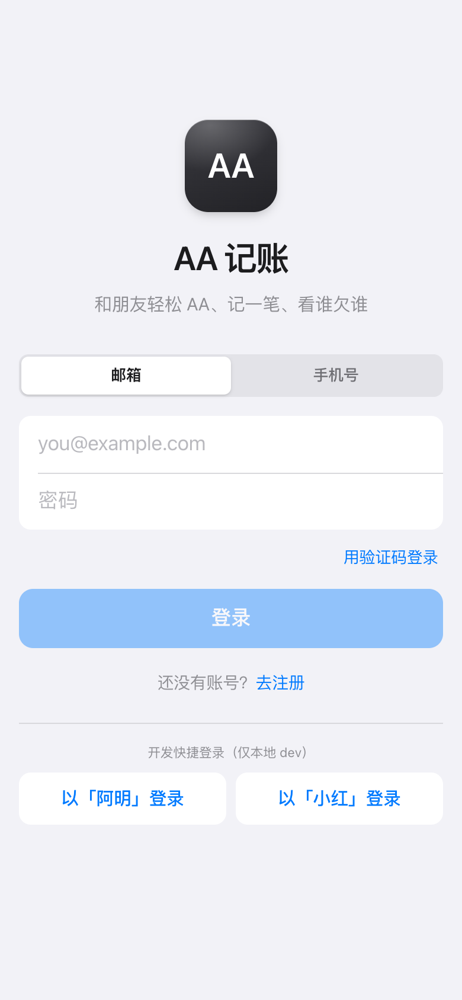
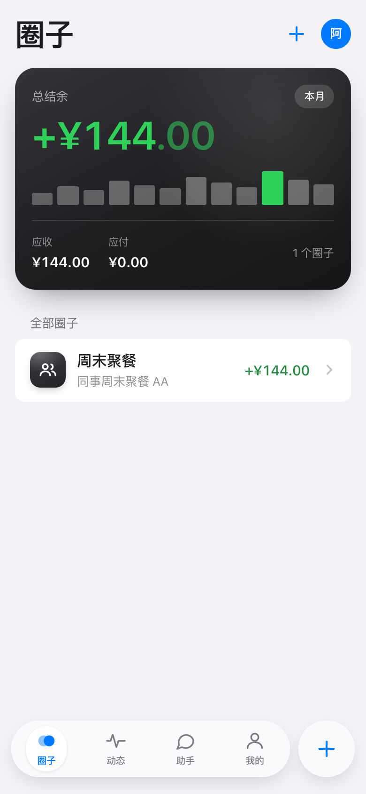
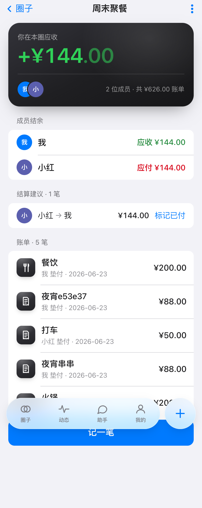
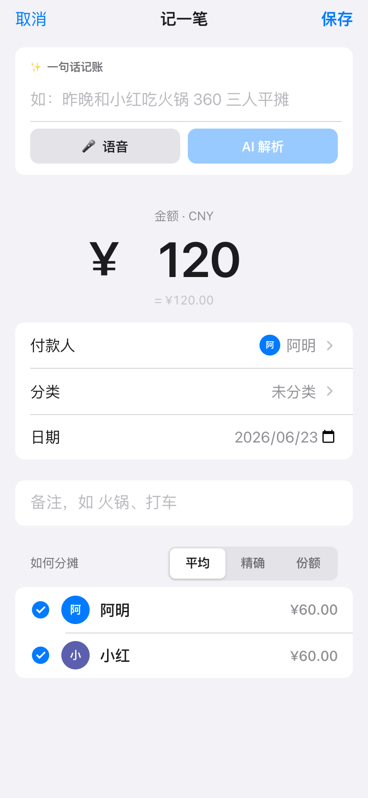
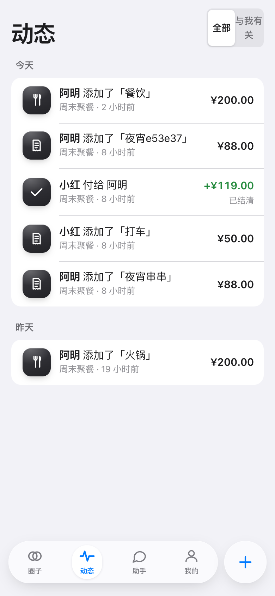
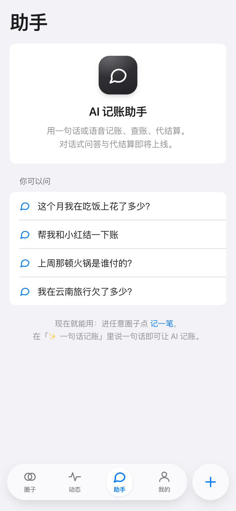
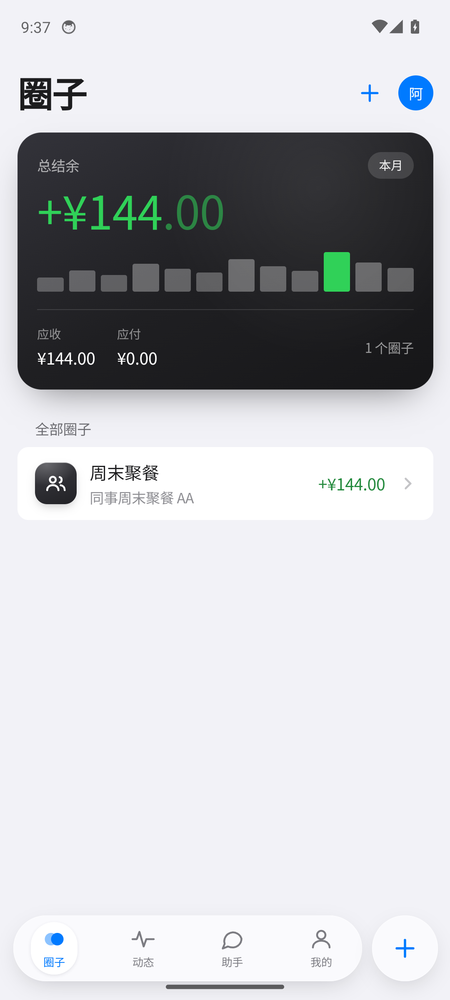
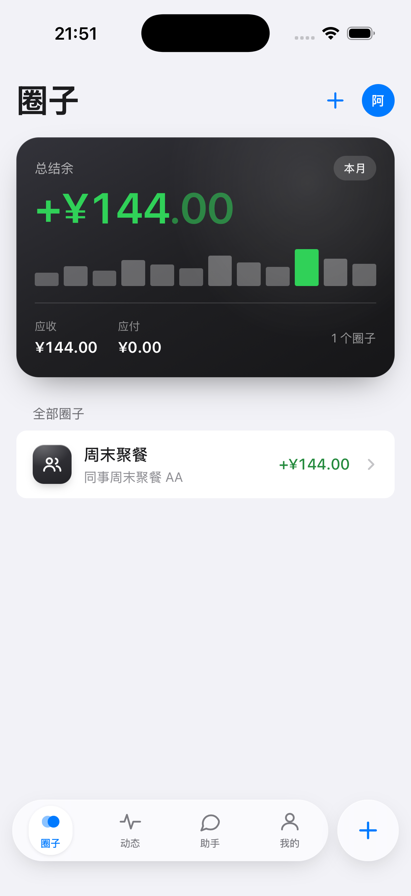

# AA · 记账分账

> 和朋友轻松 AA、记一笔、看谁欠谁 —— 一套代码,五端原生。

**AA 记账** 帮你和朋友 AA 制分账:记一笔花销,把朋友拉进「圈子」共享账本,选择和谁分摊(默认平均,也可按金额或份额),自动算出「谁欠谁多少」,再用最少的转账一键结清。还能「说一句话记一笔」——输入或语音说「昨天和小红吃饭 200 我付的」,自动填好金额、付款人和分摊。

同一份代码打包成 **Windows / macOS / Linux 桌面** 和 **Android / iOS 手机** 的原生 app。

---

## 📥 下载试用(给非开发者)

> ⚠️ **当前是技术演示版(v0.0.2)。** 安装包能正常安装、打开,看到完整界面;但它**还没有连接公开的服务器**,所以暂时**无法注册 / 登录使用真实数据**。想完整体验记账功能,需要照着下面[「给开发者」](#-给开发者)一节自建一个后端。纯想看看长什么样,直接下载安装就行。

**👉 [点这里到下载页面](https://github.com/sweetcornna/AA/releases/latest)**,在页面底部的 **Assets** 里,按你的电脑系统选对应文件:

| 你的电脑 | 下载这个文件 | 怎么安装 |
|---|---|---|
| **Windows** | `AA.Ledger_..._x64-setup.exe` | 双击运行,一路「下一步」即可 |
| **Mac**(Apple 芯片 M1/M2/M3/M4) | `AA.Ledger_..._aarch64.dmg` | 双击打开,把图标拖进「应用程序」文件夹 |
| **Linux** | `.AppImage` / `.deb` / `.rpm` | 见下方说明 |
| **Android** | `AA.Ledger_..._android-universal-debug.apk` | 允许「未知来源」后安装(debug 签名) |

> 文件名里的 `0.0.2` 是版本号,以后更新会变。Mac 暂时只提供 Apple 芯片版(2020 年后的 Mac 基本都是);Intel 老款 Mac 暂未提供。

### 第一次打开提示「无法验证 / 已损坏」?

这个 app 还没做系统签名,所以首次打开系统会拦一下,**这是正常的,不是病毒**:

- **Windows**:弹出蓝色「Windows 已保护你的电脑」→ 点「更多信息」→「仍要运行」。
- **Mac**:右键点 app 图标 →「打开」→ 再点一次「打开」。若提示「已损坏,无法打开」,打开「终端」运行下面这行再重开(把路径换成你的 app 位置):
  ```bash
  xattr -dr com.apple.quarantine "/Applications/AA Ledger.app"
  ```
- **Linux**:`.AppImage` 需先 `chmod +x 文件名` 再双击运行;`.deb`(Ubuntu/Debian)、`.rpm`(Fedora)用系统的软件安装器打开即可。

> Android 可直接从下载页装 APK;iOS 受 Apple 签名所限暂需自行构建,见[「给开发者」](#-给开发者)。

---

## 截图

| 登录 | 圈子 | 圈子详情 |
|:---:|:---:|:---:|
|  |  |  |
| **记一笔(含 AI 一句话)** | **动态** | **AI 助手** |
|  |  |  |

| Android 截图 | iOS 模拟器 |
|:---:|:---:|
|  |  |

---

## 功能

- **圈子共享账本** —— 建圈,邀请链接 / 二维码拉人,成员实时同步。
- **三种分账** —— 平均 / 精确金额 / 份额(百分比),总和永远等于账单,零头按固定规则分。
- **余额与结算** —— 「谁欠谁多少」一目了然,自动给出最少转账方案(最多 n−1 笔),可标记已付。
- **实时同步** —— A 记一笔,B 在 1–2 秒内自动看到。
- **AI 一句话记账** —— 一句话(或语音)自动解析金额 / 付款人 / 分摊,填好表单等你确认;每笔记录 AI 来源与置信度可审计。
- **AI 助手** —— 问账本(花销 / 结余 / 谁付的);让它帮你结账时先出确认卡片,点确认才落账。
- **AI 厂商无关、可插拔** —— Claude / OpenAI / 规则兜底,`ai_settings` 表运行时切换或一键关停;没配 API key 时回退到规则 provider。
- **多平台原生** —— Win / macOS / Linux / Android / iOS 共用 Tauri/React 代码；各平台实际发布与验收状态见下方表格。

---

## 🛠 给开发者

技术演示版没有公开后端;在本地跑起来需要一个 Supabase。下面是最短路径。

### 先决条件
- Node ≥ 20、npm
- [Supabase CLI](https://supabase.com/docs/guides/cli) + Docker(本地后端;macOS 可用 [colima](https://github.com/abiosoft/colima))
- 桌面 Tauri 需 Rust ≥ 1.85(`rustup`)

### 1) 安装 + 起本地后端

```bash
npm install
supabase start              # 起本地 Postgres / Auth / Realtime / Studio
supabase db reset           # 应用 migrations + seed
cp apps/app/.env.example apps/app/.env   # 填入 supabase start 输出的 URL / anon key
```

### 2) Web / 桌面开发

```bash
npm run dev  --workspace=@aa/app             # 浏览器开发
npm run tauri --workspace=@aa/app -- dev     # 桌面原生窗口(需 Rust)
```

### 3) 手机端

环境与构建脚本封装在 `scripts/`:

```bash
# Android(需 JDK17 + Android SDK/NDK,见 scripts/android-env.sh)
source scripts/android-env.sh
bash scripts/android-build-apk.sh         # 产出 debug APK
bash scripts/android-emulator-boot.sh &   # 启动模拟器
bash scripts/android-smoke.sh             # 安装 + 启动 + 截图

# iOS(需 Xcode + CocoaPods)
cd apps/app && npm run tauri -- ios build --target aarch64-sim
bash scripts/ios-smoke.sh "iPhone 17 Pro"
```

> 移动端 cargo 交叉编译需 stable Rust ≥ 1.85;`apps/app/rust-toolchain.toml` 已钉好,无需改全局默认。

### 测试

```bash
npm test                                   # packages/shared:分账 / 结算 / 余额 单测 + 属性测试
npm run typecheck --workspace=@aa/app      # 前端 tsc --noEmit
npm run build --workspace=@aa/app          # 生产构建
```

---

## 架构

```
┌───────────────────────────── apps/app ─────────────────────────────┐
│  React 19 + TS + Vite + Tailwind   (iOS Human Interface 设计)        │
│  HashRouter · TanStack Query · 乐观更新                              │
│            │                                  ▲                      │
│            ▼ Tauri v2 (系统 WebView)          │ Realtime 订阅        │
│   Win / macOS / Linux / Android / iOS 原生壳  │                      │
└────────────┬──────────────────────────────────┼─────────────────────┘
             │ @supabase/supabase-js             │
             ▼                                    │
┌──────────────────────────── Supabase ──────────┴─────────────────────┐
│ Postgres + RLS · Auth(邮箱密码/六位邮箱 OTP) · Realtime              │
│ RPC: create_circle / create_expense / create_invitation / accept…     │
│ View: circle_balances(净余额单一权威)                                 │
│ Edge Functions(Deno): parse-expense · agent-query · asr-transcribe    │
└───────────────────────────────────────────────────────────────────────┘
             ▲
             │ import(同源)
┌────────────┴──────────── packages/shared ────────────────────────────┐
│ 纯函数 + 整数分(绝不用 float):money · split · balances · settle      │
│ zod schema(前后端共享)· Vitest + fast-check 属性测试                 │
└───────────────────────────────────────────────────────────────────────┘
```

**设计原则**
- 金额一律用 **整数最小币种单位(分)`bigint`**,绝不用浮点。
- `expense_splits.owed_minor` 永远存「已算好的最终整数分」,净余额只需 `SUM`。
- 分账在前端纯函数实时预览 → 写库前算好;净余额以 `circle_balances` 视图为权威。
- 加入圈子只能由已认证用户调用受控 `accept_invitation` SECURITY DEFINER RPC，客户端不持有 service-role key。
- AI 是「加速器」不是「必经路」:ASR / LLM 任一失败都能回退到纯手动表单,记账永不中断。

### 技术栈

| 层 | 选型 |
|---|---|
| 前端 | React 19 · TypeScript(strict)· Vite 6 · Tailwind · React Router v7 · TanStack Query v5 |
| 跨平台外壳 | Tauri v2(Rust ≥ 1.85;deep-link / updater 插件) |
| 后端 | 自托管 Supabase:Postgres · Auth · RLS · Realtime · Edge Functions(Deno) |
| 共享逻辑 | `packages/shared`:整数分 money / 最大余数法分账 / 贪心最少转账 · Vitest + fast-check |
| AI | 厂商无关、可插拔；托管栈配置 OpenAI `gpt-4o-mini`，无可用 key 时规则兜底 |

### 仓库结构

```
AA/
├─ packages/shared/        跨端纯逻辑:money / split / balances / settle / zod schema (+ 测试)
├─ supabase/
│  ├─ migrations/          表 → RLS → 视图 → RPC → grants
│  └─ functions/           parse-expense · agent-query · asr-transcribe (Edge Functions)
├─ apps/app/
│  ├─ src/                 features: auth / circles / expenses / activity / assistant / profile
│  └─ src-tauri/           Tauri v2 工程 + gen/(Android/iOS 原生工程,含构建修复)
├─ scripts/                构建 / 冒烟 / E2E 脚本(android-* · ios-* · verify-* · shot-*)
└─ docs/                   截图等
```

### 平台状态

| 平台 | 当前公开包 | 仓库构建路径 | v0.0.4 验收状态 |
|---|:---:|:---:|:---:|
| macOS / Windows / Linux 桌面 | v0.0.2 技术演示 | 已有 | 不在本次发布范围 |
| Android | v0.0.2 debug 演示 APK | release arm64 APK | 正式候选尚未发布；真机验收已豁免且不得声称通过 |
| iOS | 无公开包 | 已有 | 不在本次发布范围 |
| Web | 无公开托管版 | 已有 | 不在本次发布范围 |

---

## 说明

- 本地 Supabase 的 anon key 是标准本地开发密钥(公开、非生产),`.env` 已被 `.gitignore` 排除,仓库只含 `.env.example` 占位符。
- 当前公开 v0.0.2 是未注入公开后端的技术演示包。v0.0.4 只允许通过手动 `candidate` → `publish` 两阶段 workflow 发布：候选构建一次，publish 原样上传同一 APK；tag 本身不会自动发布。
- AI 解析走 Edge Function `parse-expense`；本地可配置受支持 provider，Azure 托管栈固定使用 server-side OpenAI 配置，未配置可用 key 时回退到规则解析。
- 移动端构建踩过的坑(本机 JVM 的 AES-GCM intrinsic 导致 TLS 下载损坏、`npm run` 切 cwd 致 cargo 用错 toolchain 等)已固化进 `gradle.properties` / `rust-toolchain.toml` / `scripts/`。
